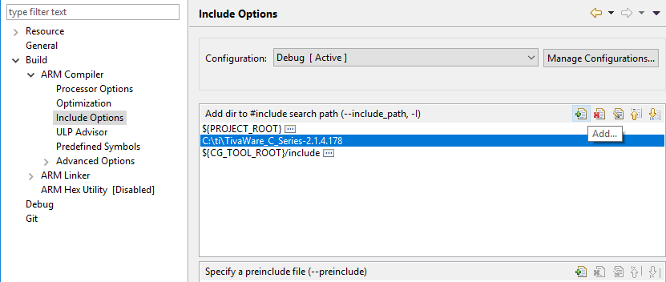
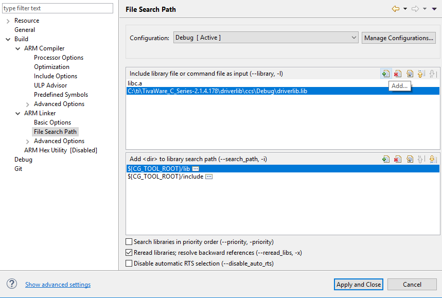

<h1>MSE450 Real Time Embedded System</h1>

<h2>Get Started</h2>

<b>MCU Board: </b>TM4C123GH6PM  
<b>IDE: </b>Code Composer Studio v7 or above
 

<h2>Optional Requirements</h2>

If main.c has something like:

<blockquote>
  #include "driverlib/gpio.h"  
  #include "inc/hw_memmap.h"  
</blockquote>

External TivaWare library will need to be linked. TivaWare installation exe can be downloaded at <a href="http://software-dl.ti.com/tiva-c/SW-TM4C/latest/index_FDS.html">TI's website</a> 
Look for title "SW-TM4C-2.1.4.178.exe" and description "TivaWare for TM4C Series". Download and install it. 
To link TivaWare to the project, open Code Composer Studio, right click on your project under Project Explorer, select "Properties". Then add TivaWare_C_sereis to the include search path like below image.  

Lastly, add driverlib to the file search path.  
